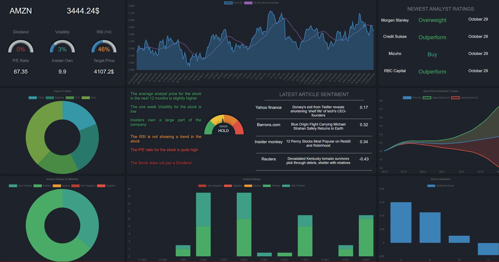
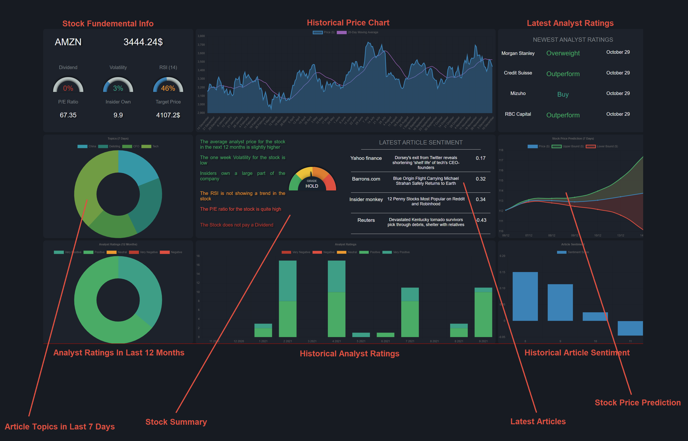
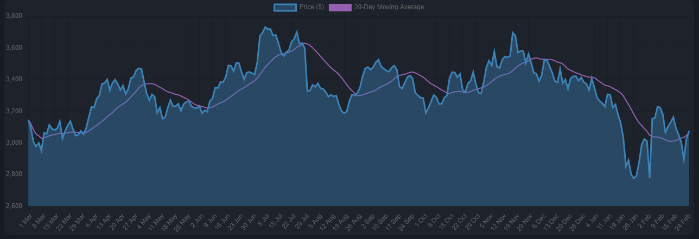
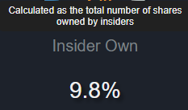
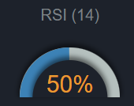
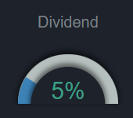
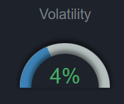

<div id="top" align="center">

</div>


<br />
<div align="center">
  <a href="https://github.com/othneildrew/Best-README-Template">
    
  </a>

  <h3 align="center">Stock Dashboard </h3>

  <p align="center">
    Capstone Project by Andris Vaivods
      <p align="center">
    <br />
    University Of Essex
    <br />
    <br />
    <a href="https://cseegit.essex.ac.uk/ce301_21-22/CE301_vaivods_andris_j"><strong>Explore the docs »</strong></a>
    <br />
    <br />
    <a href="">View Demo</a>
    ·
    <a href="">Report Bug</a>
    ·
    <a href="">Request Feature</a>
  </p>
</div>


<!-- TABLE OF CONTENTS -->
<details>
  <summary>Table of Contents</summary>
  <ol>
    <li>
      <a href="#about-the-project">About The Project</a>
      <ul>
      <li><a href="#features">Features</a></li>
        <li><a href="#built-with">Built With</a></li>
      </ul>
    </li>
    <li><a href="#getting-started">Getting Started</a></li>
     <li><a href="#technical-documention">Technical Documention</a></li>
      <ul>
        <li><a href="#prerequisites">Prerequisites</a></li>
        <li><a href="#installation">Installation</a></li>
      </ul>
    </li>
    <li><a href="#usage">Usage</a></li>
    <li><a href="#roadmap">Roadmap</a></li>
    <li><a href="#license">License</a></li>
    <li><a href="#contact">Contact</a></li>
    <li><a href="#acknowledgments">Acknowledgments</a></li>
  </ol>
</details>


<!-- ABOUT THE PROJECT -->
## About The Project

Ther Stock Dashboard  is a website where the user can view live data on stocks, such as their article sentiment, analyst target prices stock predcitions and more,  all made in the backend Python pipeline. The artilce data is webscraped and then cleaned using BeutifulSoup and Pandas. Topics are extraceted form the text  and  setnimtn is analyzed using a lexicon based approuch with the VADER setimnet analyzer. Stock price predictions are made using historical price and a Long short-term memory (LSTM) neral network.  All the data is stored on MongoDB Atlas and is visulized on the webiste using Node.js and Chart.js
<p align="right">(<a href="#top">back to top</a>)</p>

## Aims and Objectives

### MVP


### Final Product

<p align="right">(<a href="#top">back to top</a>)</p>

## 

## Features

The user can view data such as:

* Stock Fundemental metrics
	* <a href="#historic-price">Historic Price</a>
	*  <a href="#insider-own-%">Insider Ownership</a>
	* <a href="#relative-strength-index">Relative Strength Index</a>
	* <a href="#dividend">Dividend</a>
	* <a href="#volatility">2-week Volatility</a>
	* <a href="#price/earning-ratio">Price/Earning ratio</a>
	* <a href="#analyst-target-price">Analyst Target Price</a>
	*  Informational Tooltips
* Articles
	* <a href="#latest-articles">Latest articles about the stock, including publisher,  sentiment and a link to the article</a>
	* <a href="#historical-article-sentiment">Historical Article Sentiment and Sentiment Trends</a>
	* <a href="#latest-article-topics">Latest Article Topics</a>
* Analyst ratings
	* <a href="#latest-analyst-ratings">Latest analyst ratings</a>
	* Historical analyst ratings by month
	* Analyst ratings in the last 12 months
*  Stock predictions for the next 7 days 
* A summary of all the inforamtion in a textual form
* A generated Buy/Hold/Sell rating based on all the above information


<div id="image" align="center">

</div>

#### Historic Price

In this graph the user can view the price of the stock over the last year as well as the 20-day moving average. This graph is an imprantm etric for viewing the hisric trends in the stock as well as view mediuim term support in the term of a moving average. 

<div id="image" align="center">

</div>

#### Insider Ownership

Insider Ownership is calculated as the total number of shares owned by insiders. A high value of insider ownership means that those working for the company have a large stake in the success of the company, which can be bullish for the stock.

<div id="image" align="center">

</div>

#### Relative Strength Index

The relative strength index (RSI) is a momentum indicator used in technical analysis that measures the magnitude of recent price changes to evaluate overbought or oversold conditions in the price of a stock or other asset. Traditional interpretation and usage of the RSI are that values of 70 or above indicate that a security is becoming overbought and reading of 30 or below indicates an oversold condition.
To better visulize the index,  I color coded the number (green for under 35% and red for over 70%) as well as used a speedometer / progress bar.

<div id="image" align="center">

</div>

#### Dividend

A dividend is the distribution of corporate profits to eligible shareholders, ususally messured in terms of a percentage realtive to stock price. It can be used a value indicator as well as an inidicator for how profitable a stock is.

<div id="image" align="center">

</div>

#### Volatility 

Volatility is the rate at which the price of a stock increases or decreases over a particular period, in this case the last 2 weeks. Higher stock price volatility often means higher risk and helps an investor to estimate the fluctuations that may happen in the future.

<div id="image" align="center">

</div>

#### Price / Earning-Ratio

Volatility is the rate at which the price of a stock increases or decreases over a particular period, in this case the last 2 weeks. Higher stock price volatility often means higher risk and helps an investor to estimate the fluctuations that may happen in the future.

<div id="image" align="center">

</div>

####  Analyst Target Price
A price target is a price at which an analyst believes a stock to be fairly valued relative to its projected and historical earnings. The average price target is caluacted using the avergae of the latest analyst price targets for the the next 12 months.

<div id="image" align="center">

</div>

#### Latest Articles
In the middle right section of the dashboard there are the latest articles about the stock. The user can view the publisher, title and the color coded sentiment of the text. The user can also view the whole article by clicking on it. The setniment is calculated in the backend Python pipeline.

#### Historical Article Sentiment
In the bottom right section of the dashboard the user can view daily sentiment scores for articles as well as the Moving averages of this sentiment to get a better undertanding of the public sentiment trends for the stock.

#### Latest Article Topics
In the middle left section the user can view the latest topics for articles. This gives the user a quick glimpse into what topics the public are talking about and could give ideas into what user should do more research into.

#### Latest analyst ratings


### Built With


* [Node.js](https://nodejs.org/en/)
* [Chart.js](https://www.chartjs.org/)
* [Express.js](https://expressjs.com/)
* [NLTK](https://www.nltk.org/)
* [Beautiful soup](https://www.crummy.com/software/BeautifulSoup/bs4/doc/)
* [Gensim](https://radimrehurek.com/gensim/)
* Hosted with [Heroku](https://www.heroku.com/)
* Cloud storage with [MongoDB]()

<p align="right">(<a href="#top">back to top</a>)</p>


## Technical Documention

### Code walkthrough

~~~python
~~~

#### Web Scraping
I extracted data such as the articles and fundematal infonmarion,  from Finviz, and used the yahoo finance API to get the historeic price and analyst ratings. For web scraping I used the Requests library to open the corresponing sotkc page on finviz as well as to open the original article page. 
~~~python
def get_all_articles(ticker):
    finviz_url = "https://finviz.com/quote.ashx?t="
    url = finviz_url + ticker
    req = Request(url=url, headers={"user-agent": "my-app"})
    response = urlopen(req)
    html = bs(response, features="html.parser")
    news_table = html.find(id="news-table")
    
    return news_table
~~~

To extract the artilce infomation such as publisher, title, origanl link and date I used the BeutifulSoup library.  After aquiring the news_table text contents, I traversed every row in the table to extract the date , after hcih I extract the link to the origanl article and call ```get_article_text``` to open the article page and extract the text.

~~~python
def parse_articles(ticker, name, tr):
    parsed_data = []
    for row in tr:
        title = row.a.text  # Get title
        date_data = row.td.text.split(" ")  # Get date
        if len(date_data) == 1:
            time = date_data[0]
        else:
            date = date_data[0]
            time = date_data[1]
        date_time = date + " " + time
        date_time = dt.datetime.strptime(date_time, "%b-%d-%y %H:%M%p ")
        if(date_time.date() < dt.datetime.today().date()):
            article_link = row.find("a", {"class": "tab-link-news"}).attrs[
                "href"]
            publisher = row.span.text.strip().lower()
            article_text = get_article_text(article_link, publisher)
            if(date_time.date() == dt.datetime.today().date()):
                break
            if article_text != "" and is_article_important(ticker.lower(), name, article_text, title):
                parsed_data.append(
                    [ticker, date_time, publisher, title,
                        article_link, article_text]
                )
    return parsed_data
~~~

To get the full text of the artilce I use the ```get_article_text``` function. Depening on the publisher, the etext is extarced from the correct html element.  After extracing the text, I remove any unnecesarry whitespace.
~~~python
def  get_article_text(href, publisher):
 yahoo_publishers = [
        "bloomberg",
        ...
        "investorplace"
    ]
    try:
        req = Request(url=href, headers={"user-agent": "my-app"})
        response = urlopen(req)
        html = bs(response, features="html.parser")  # Get HTML of article
        if publisher == "motley fool": # Depending on publisher, extract article text
            article_text = html.find(class_="tailwind-article-body").text
        elif publisher in yahoo_publishers:
            article_text = html.find(class_="caas-body").text
            ...
        else:
            article_text = ""
            print("Didnt Work")
    except Exception as e:
        print("ERROR")
        article_text = ""
        
    article_text = " ".join(article_text.split()) # Remove unnecessary whitespace
    return article_text
~~~


If successful the article title is and text are achecked in ``` is_article_important``` function. For an article to be considered important the title has to cointant either the name or the ticker or it has to be mentoioned atleast 5 times in the article. I decided on these rules because  firstly if the title coanints the name of the stock it is very likely that it is important. Secondly because after trying out differnet number of times, I came to the conclusion that 5 results in  a good balance of importance and amount of articles filtered. 

~~~python
def is_article_important(ticker, name, article, title):
    article_clean = re.sub(r'\W+', ' ', article)
    title_clean = re.sub(r'\W+', ' ', title)
    if(count_occurrences(ticker, title_clean) >= 1 or count_occurrences(name, title_clean) >= 1):
        return True
    if(count_occurrences(ticker, article_clean) + count_occurrences(name, article_clean) >= 5):
        return True

    return False
~~~
To make it easear to filter, analyze and save the articles I put them in a Pandas dataframe

~~~python
df = pd.DataFrame(
	parsed_data, columns=["Ticker", "Date",
                          "Publisher", "Title", "Link", "Text"])
~~~


After extracting the articles, I move on to gettign the analyst ratings. To do this I use the yahoofinace API. For the <a href="#latest-analyst-ratings">Latest analyst ratings</a> section I extract the 4 newest analyst ratings and save them in a dictionary, to later save into the database

~~~python
df_recom = tickerData.recommendations
df_recom_last_4 = df_recom.iloc[-4:]
dict_recom_last_4 = create_dict_for_anaylst_ratings(df_recom_last_4, ticker)
~~~


~~~python


~~~
~~~python
~~~
~~~python
~~~
~~~python
~~~

#### Topic Extraction


### Testing


### Database

### Literture Survey


<!-- GETTING STARTED -->
## Getting Started

To get a local copy of the website up and running follow these simple example steps.

### Prerequisites

This is an example of how to list things you need to use the software and how to install them.
* npm
  ```sh
  npm install npm@latest -g
  ```

### Installation


1. Clone the repo
   ```sh
   git clone https://cseegit.essex.ac.uk/ce301_21-22/CE301_vaivods_andris_j.git
   ```
2. Install NPM packages
   ```sh
   npm install
   ```
3. Start the node.js server
   ```js
   npm start
   ```
 4.  Go to [http://localhost:8000/](http://localhost:8000)

<p align="right">(<a href="#top">back to top</a>)</p>


<!-- USAGE EXAMPLES -->
## Usage


Use this space to show useful examples of how a project can be used. Additional screenshots, code examples and demos work well in this space. You may also link to more resources.


<p align="right">(<a href="#top">back to top</a>)</p>


<!-- ROADMAP -->
## Planning Record

### Jira

### Gitlab

### Gantt


<p align="right">(<a href="#top">back to top</a>)</p>


## Future Imrpovements


<!-- LICENSE -->
## License

Distributed under the MIT License. See `LICENSE.txt` for more information.

<p align="right">(<a href="#top">back to top</a>)</p>


<!-- CONTACT -->
## Contact

Andris Vaivods -  av19256@essex.ac.uk - andris.vaivods11@gmail.com

Project Link: [https://github.com/your_username/repo_name](https://github.com/your_username/repo_name)

<p align="right">(<a href="#top">back to top</a>)</p>


